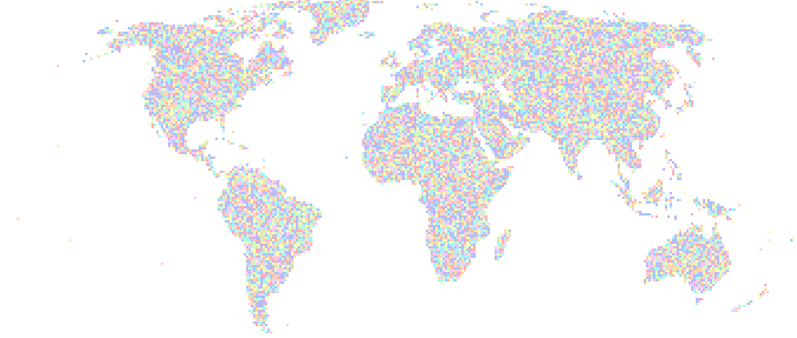

    
    
    
    
    <!--  -->
     

    <!--  -->
    

# Hyla-SLAM
Hyla-SLAM is a behavior tree-based, ROS-enabled SLAM framework that maximizes the scalability of 3D LiDAR-based SLAM via several facets. It uses dynamic data management strategies to flexibly preserve a subset of map data in memory while offloading unwanted data to disk, enabling building and maintaining extremely large maps on computationally constrained systems. Using its behavior tree interface, it can be flexibly reconfigured with additional pre- or post-processing stages to generate and use task-specific maps.

For additional details, users are referred to our [paper]().

<video src="https://github.com/user-attachments/assets/5b4163a9-44ef-4ea1-8492-9963a6845a20" autoplay loop muted controls width="50%"></video>

---
### Intent
Hyla-SLAM was developed in response to the inherent trade-offs in SLAM system design — between map density and extent on resource-constrained systems, integrated framework performance versus high-level reconfigurability, and performance on a specific system versus robot-agnosticism. These competing demands make it challenging to build a system that does everything well. While much of the SLAM community prioritizes localization accuracy when evaluating approaches, our focus is on cross-system and cross-application utility.

<video src="https://github.com/user-attachments/assets/ac213d90-b240-4fb5-9210-d73d61545602" autoplay loop muted controls width="50%"></video>

---
### Running
The easiest way to get up and running with Hyla-SLAM is by running the corresponding [example](https://github.com/swanbeck/coral_examples/tree/main/hyla_slam) using the [Coral CLI](https://github.com/swanbeck/coral_cli). 

To maximize flexibility at runtime, users should prefer to engineer and execute a [BehaviorTree.CPP](https://github.com/BehaviorTree/BehaviorTree.CPP) behavior tree to use Hyla-SLAM. Examples of behavior trees using the [hyla_slam_behaviors](./hyla_slam_behaviors/) can be found [here](https://github.com/swanbeck/coral_examples/blob/main/hyla_slam/bt.xml) and [here](https://github.com/swanbeck/coral_examples/blob/main/corrosion_mitigation/husky/bt.xml).

---
### Eponym
Hyla-SLAM is named after the 16th century German cartographer Martin Waldseemüller, who sometimes wrote under his Latinized name *Hylacomylus*. In 1507, Waldseemüller was the first cartographer to use the name 'America' for the newly-discovered lands in the western hemisphere. He is also credited with creating the first atlas in 1513. His 1507 map of the world is discretized into 12 smaller sub-maps, as shown below. This discretization into smaller chunks mirrors the dynamic storage properties of this software, and the unprecedented scale of Waldseemüller's world map matches the scale made possible by Hyla-SLAM.

  

Waldseemüller, Martin. Universalis cosmographia secundum Ptholomaei traditionem et Americi Vespucii aliorumque lustrationes. [Strasbourg, France: s.n, 1507] Map. Retrieved from the Library of Congress, www.loc.gov/item/2003626426/.

<!-- ### Citation
If you find Hyla-SLAM useful in your work, please consider citing our paper: -->
